# Warning banner variations

Current implementation, captured October 9, 2026. All names and failure states are synthetic fixtures. Machine screenshots show the Settings page; plugin screenshots show the production banner in isolation.

Mobile: 390 × 844. Desktop: 1280 × 900.

| Variation                           | Mobile                                                                                                   | Desktop                                                                                                    |
| ----------------------------------- | -------------------------------------------------------------------------------------------------------- | ---------------------------------------------------------------------------------------------------------- |
| One offline machine                 | 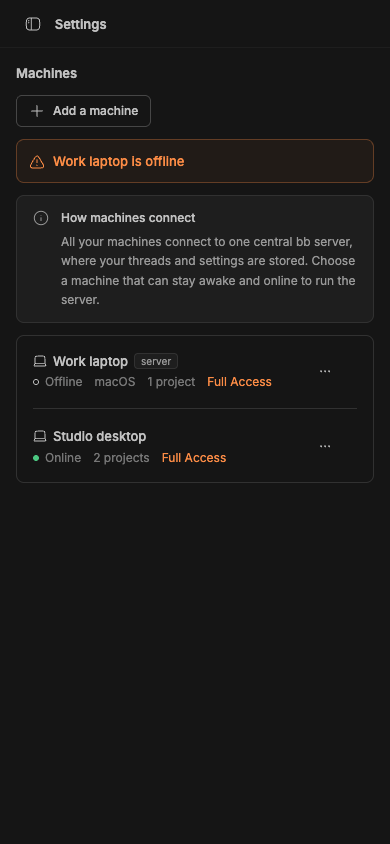                | 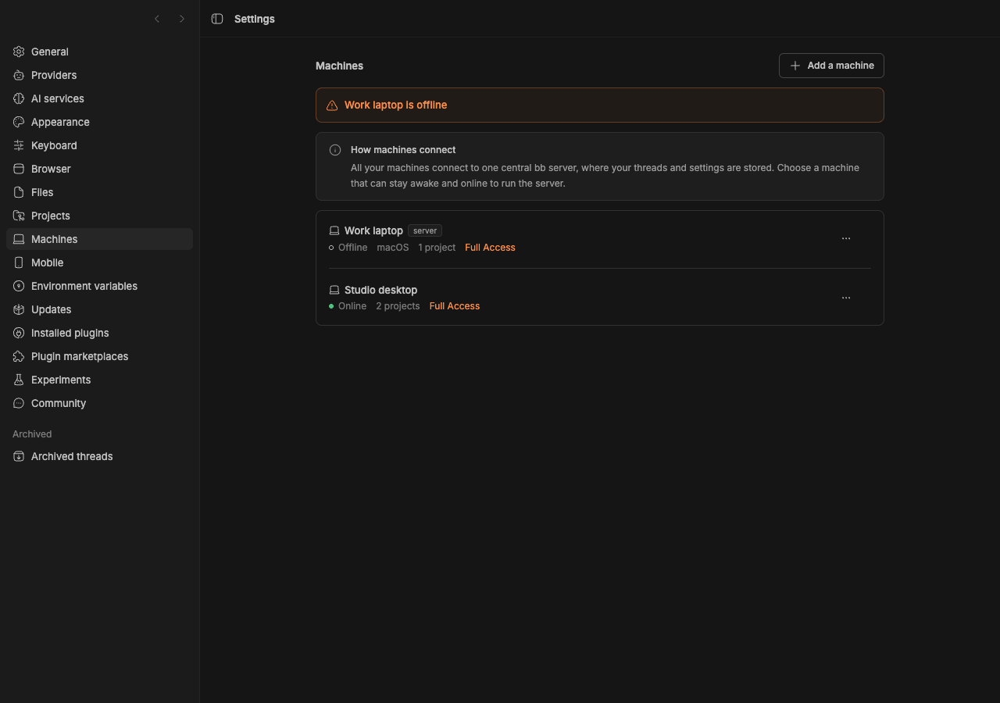                |
| Multiple offline machines           | 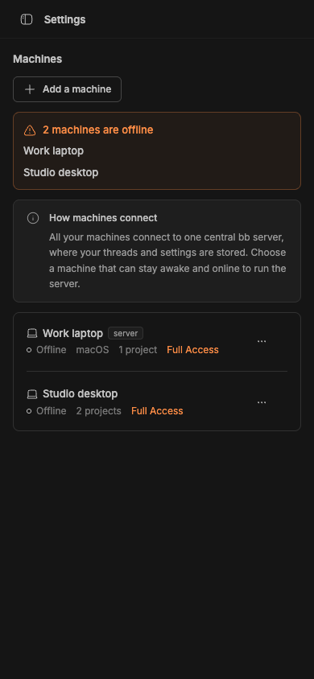        | 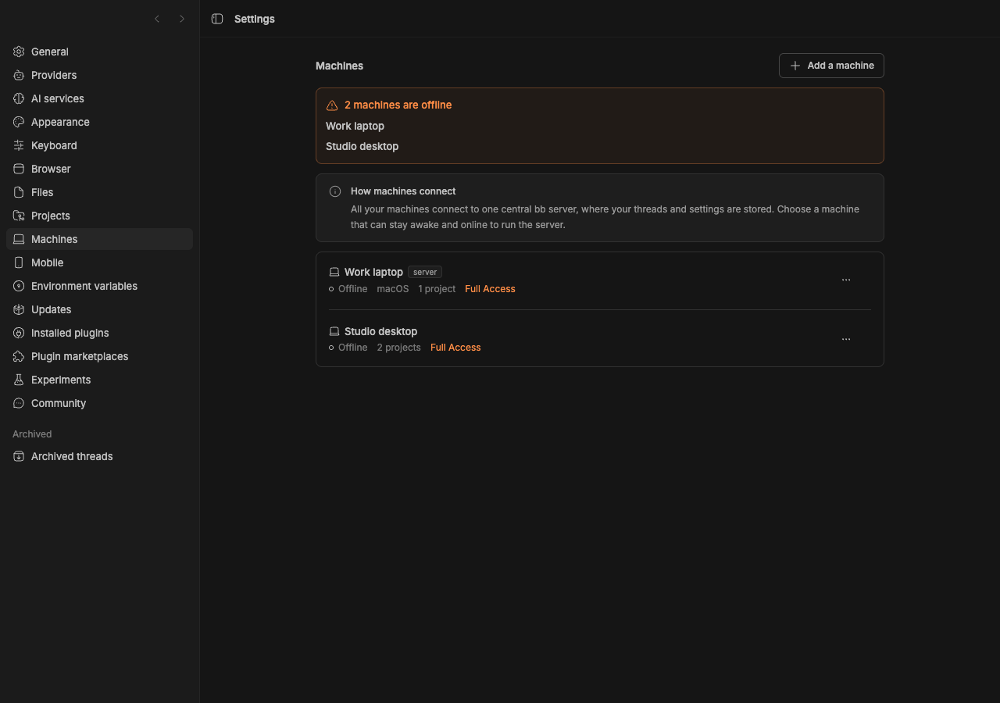        |
| Machine cleanup failed              | 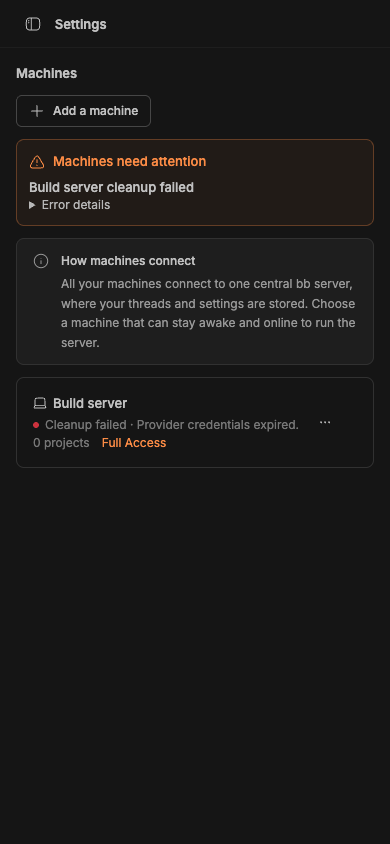            | 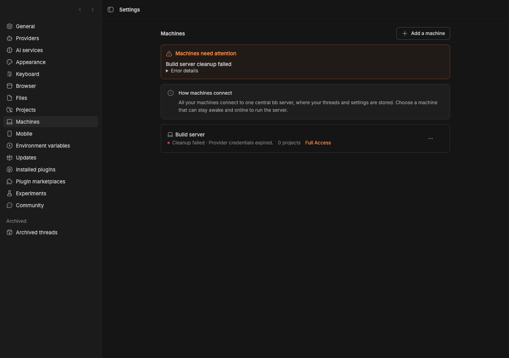            |
| Offline machine and cleanup failure | 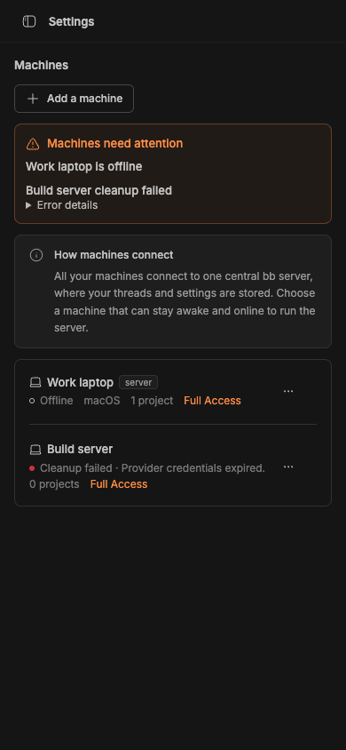 | 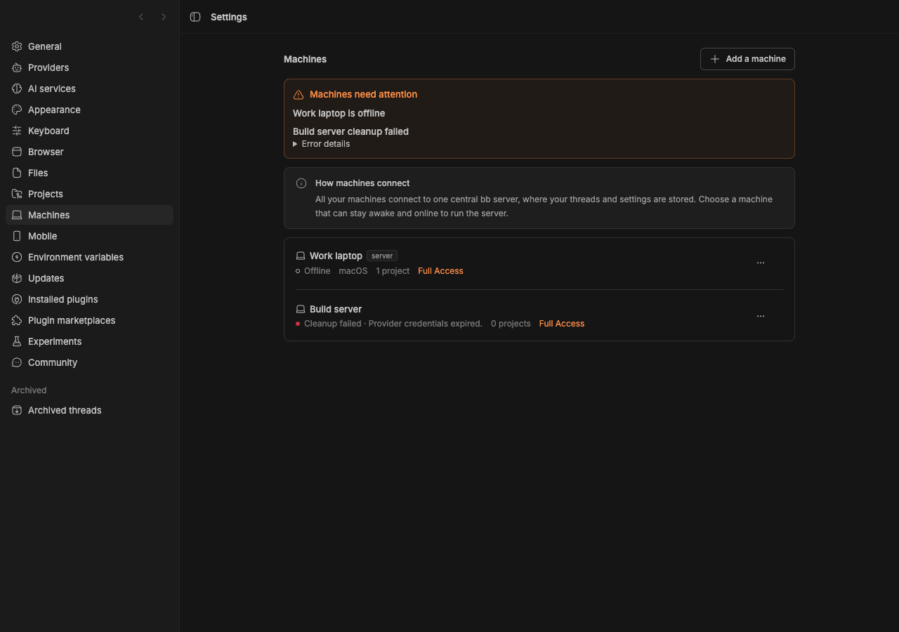 |
| One incompatible plugin             | 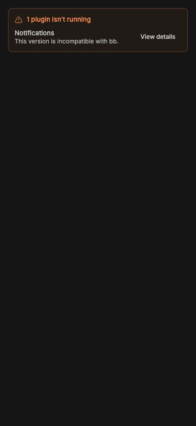             |              |
| Multiple plugins not running        | 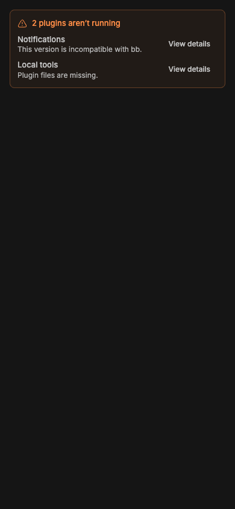      | 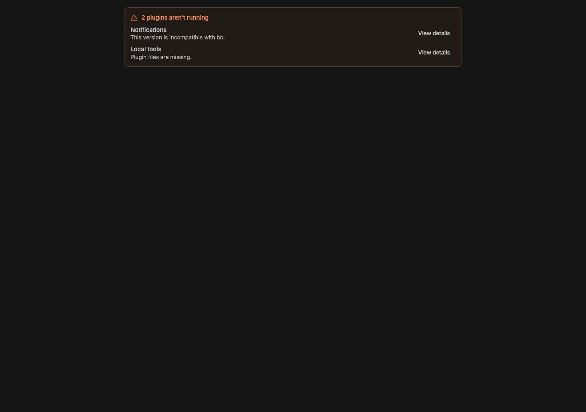      |
| Plugin files missing                | 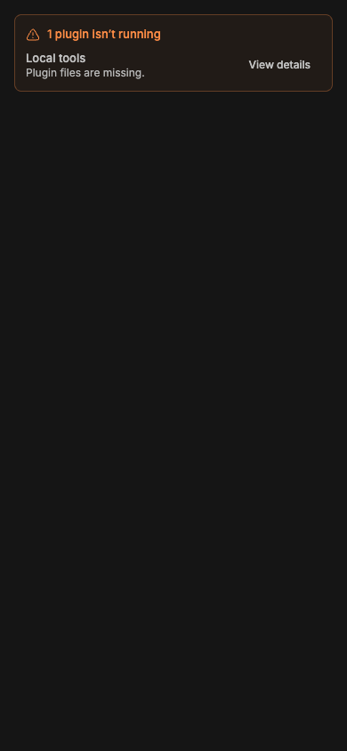               |                |
| Plugin failed to start              | 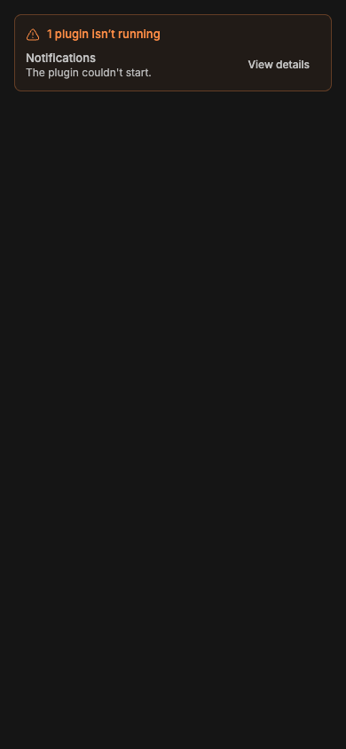               | 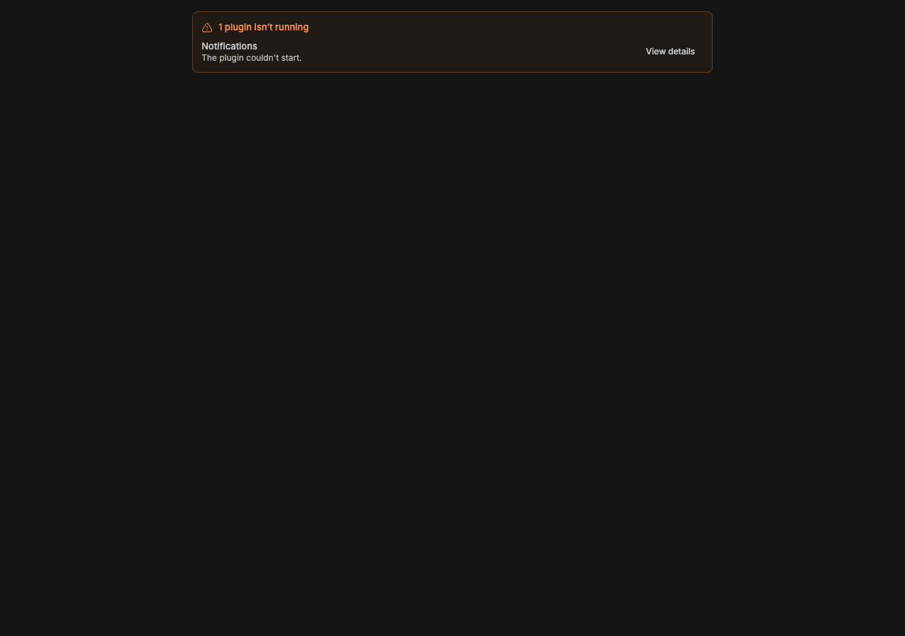               |
